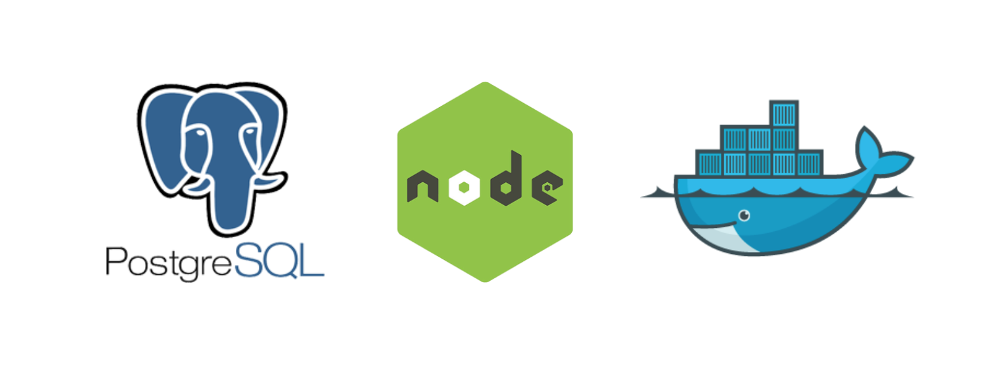

# NodeJS API Template



This is a Node.js Api Template. It uses Express, PostgreSQL, Sequelize and Docker.

## Usage

1. Clone the repo

   ```sh

   git clone https://github.com/karokojnr/nodejs-api-template.git

   ```

2. Install npm packages

   ```sh

   npm install

   ```

3. To run the app:

   ```sh

   npm start

   ```
## Contributing

Pull requests are welcome. For major changes, please open an issue first to discuss what you would like to change.